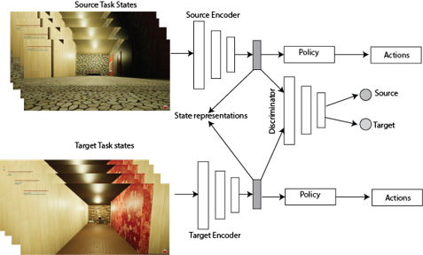

# [Domain Adaptation in Unmanned Aerial Vehicles Navigation and Obstacle Avoidance using Deep Reinforcement Learning](https://github.com/hemanthkandula/Drone-Navigation-Domain-Adaption)

**Abstract:**

>  Recent advancements in deep reinforcement learning (RL) inspired end-to-end learning of Unmanned Aerial Vehicles (UAV) navigation. However, they can be slow to train and require lots of interactions with the environment, as these reinforcement learning algorithms have no prior knowledge about the environments or tasks. Transfer learning was shown to useful to help in some problems in transferring knowledge from a source task to a target task. But most RL problems direct TL with fine-tuning might not be the best solution to transfer knowledge between tasks, environments. Our work presents an adversarial domain adaption method for UAV navigation and obstacle avoidance. We align state representations of pre-trained source domain with target domains and demonstrate in a realistic drone simulator that initialization with domain adaption showed significant performance improvements over RL task learned from scratch.

##Framwork



## Environment
 Downlaod indoor_updown environment. [Link to download](https://tufts.box.com/s/walg8vs7mjm6i3nnczlupd41vaymg8dy) Download env and place it under ```unreal_envs/indoor_updown```

## Requirements
```pip install requirements.txt```

## Training Source Task:

1. Edit in ```configs/config.cfg``` files
    - set Target: false
    - set data_collect: false
    - set mode : train

2. Run ``` python main.py ```


## Training Target Task:

1. Edit in ```configs/config.cfg``` files
    - set Target: true
    - set data_collect: false
    - set mode : train

2. Run ``` python main.py ```


## Collecting Source Task Dataset for adaption :

1. Edit in ```configs/config.cfg``` files
    - set Target: false
    - set data_collect: true
    - set mode : train
 
2. Edit  ```configs/DeepQLearning.cfg``` file
    - set custom_load: true
    - set custom_load_path: trained model here 
    - set epsilon_saturation: 100 because we want model to be greedy


2. Run ``` python main.py ```

3. Stop once if data collection  is enough for training.
    32 images collected for every 100 training steps


## Collecting Target Task Dataset for adaption :

1. Edit in ```configs/config.cfg``` files
    - set Target: true
    - set data_collect: true
    - set mode : train

2. Run ``` python main.py ```

3. Stop once if data collection  is enough for training.
    32 images collected for every 100 training steps


## Domain Adaption:

1. Collect path for Source model encoder.ckpt,classifier.ckpt files.
2. data path is already set
3.  Run ``` python adda_main.py ```


## Retraining policy and value function Target Task:

1. Edit in ```configs/config.cfg``` files
    - set Target: true
    - set data_collect: false
    - set mode : train

2. Edit  ```configs/DeepQLearning.cfg``` file
    - set custom_load: true
    - set custom_load_path: 'adda/adapted_target/'


2. Run ``` python main.py ```


## Infer Target Task from scratch:

1. Edit in ```configs/config.cfg``` files
    - set Target: true
    - set data_collect: false
    - set mode : infer

2. Edit  ```configs/DeepQLearning.cfg``` file
    - set custom_load: true
    - set custom_load_path: scratch trained model here

2. Run ``` python main.py ```


## Infer adapted Target Task :

1. Edit in ```configs/config.cfg``` files
    - set Target: true
    - set data_collect: false
    - set mode : infer

2. Edit  ```configs/DeepQLearning.cfg``` file
    - set custom_load: true
    - set custom_load_path: path to retrained model after adaption

2. Run ``` python main.py ```
